@(Math)[CNN]

#CS231n
[toc]
## Introduction to Convolutional Neural Networks for Visual Recognition
### What  is the task in computer vision
**Theory:**
- David Marr (1970s)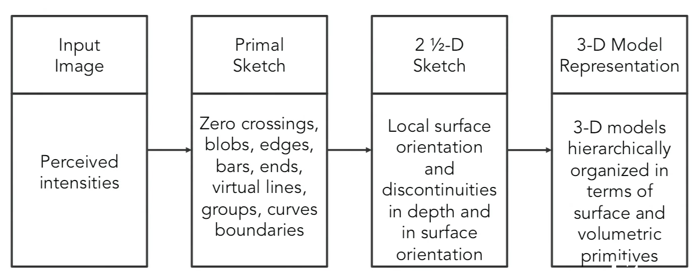
- Every object is compose of simple geometric object(Brooks & Binford, Generalized Cylinder, 1979; Fischler and Elschlager, Pictorial Structure 1973.)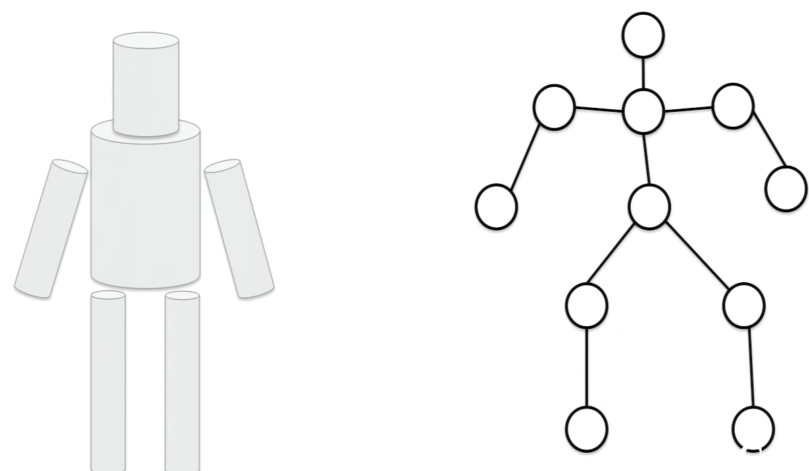
- David Lowe (1987) lines, edges, and their combination
- David Lowe (1999) "SIFC" & Object Recognition
**Mehonds**
- Normalized Cut(Shi &Malik, 1997)
	- Using **graph algorithm** theory for  Image segmentation
- Face detection, Viola & Jones 2001.
	- Using **AdaBoost algorithm** do the Face detection
- Spatial Pyramid Matching, Lazbnik, Schmid & Ponce, 2006
***
<font color='red'>**Good resource: http://image-net.org/**</font>
***

##  Image Classification
**Challenges**
- **Semantic Gap:** semantic idea of cat and the pixels that computer actually seeing.
- **Viewpoint variation**
- **Illumination**
- **Deformation**
- **Occlusion**
- **Background clutter**
- **Intraclass variation**

**Data-Driven Approach**
1. Collect a datasets of images and lables
2. Use Machine Learning to train a classifier
3. Evaluate the classifier on new images

### Classifier
#### Nearest Neighbors 
1. Memorize all data and lables (O(1))
2. Predict the label of the most similar training image (O(N))
```python
import numpy as np
class NearestNeighbor:
	def __init__(self):
		pass
		
	# Machine learing!
	def train(self,X,y):
		''' X is N x D where each row is an example, Y is 1-dimension of size N '''
		# the nearest neighbor classifier simply remembers all the training data
		self.Xtr= X
		self.ytr = y
	
	# Use model to predict labels
	def predict(self,X):
		'''X is N x D where each row is example we wish to predict for '''
		num_test = X.shape[0]
		# lets make sure that the output type matches the input type
		Ypred = np.zeros(num_test, dtype = self.ytr.dtype)
		
		# loop over all test rows
		for i in xrange(num_test):
			# find the nearest trainning image to the i'th test image
			# using the L1 distance (sum of absolute value differences)
			distances = np.sum(np.abs(self.Xtr-X[i,:]),axis =1)
			min_index = np.argmin(distances) # get the index with smallest distance
			Ypred[i] =self.ytr[min_index] # predict the label of the nearest example
			
		return Ypred
```
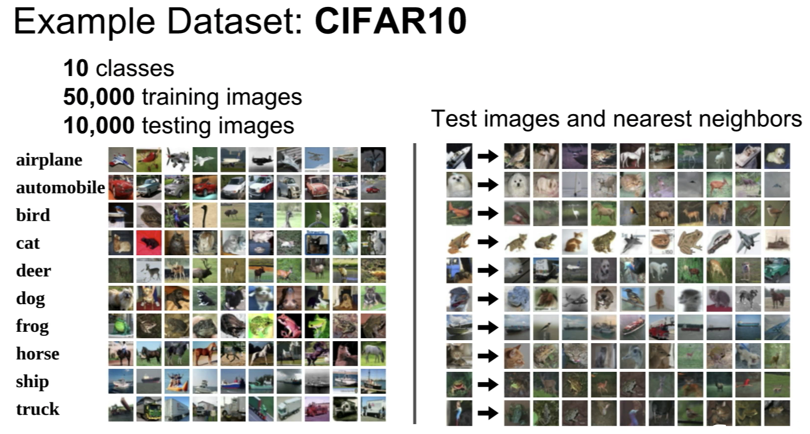

#### Distance Metric to compare images
- L1(Manhattan) distance: $d_1(I_1,I_2) = \sum_p|I_1^p -I_2^P|$
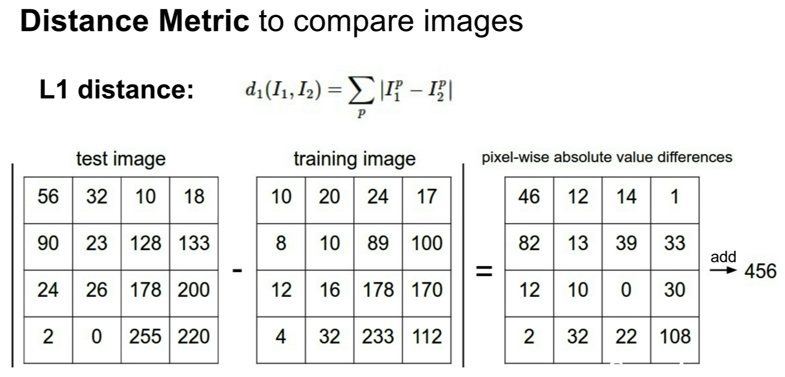
- L2(Eclidean) distance $d_2(I_1,I_2) =\sqrt{\sum_p(I_1^p -I_2^P)^2}$
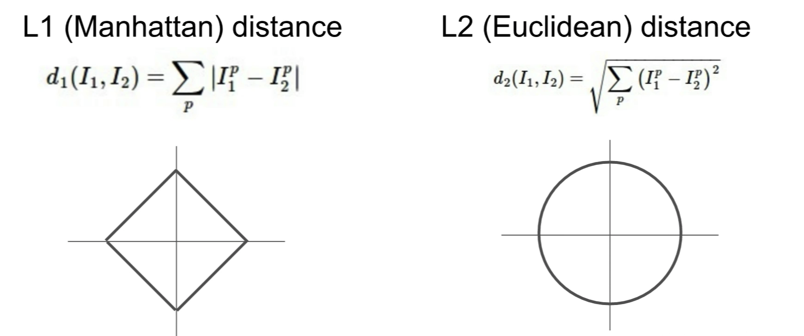
> Difference
> - The L1 depends on your choice on coordinate systems (**Choose when input feature have important meaning for your test**)
> - The L2 is independent on your choice on coordinate systems (**Choose when input vectors(feature) are just gemetric features from some space and you don't know which of the different elements mean**)
> 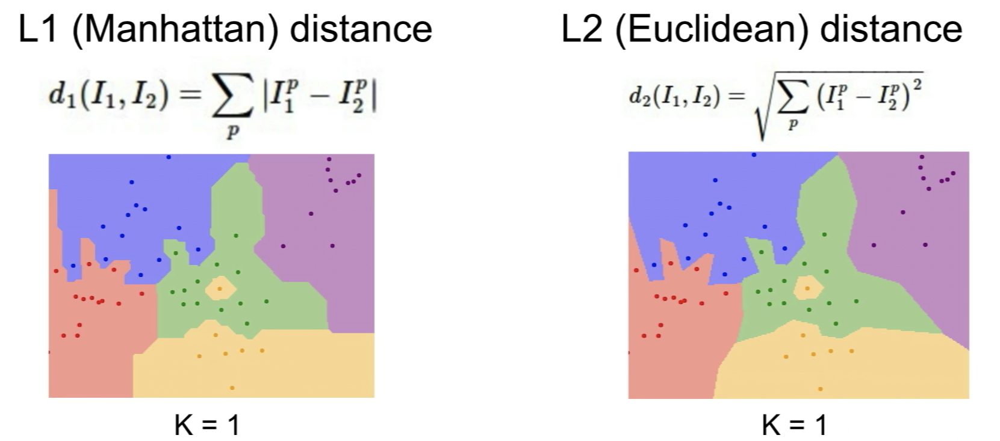
> The decision boundaries of L1 tend to follow the coordinate axes.
> The decision boundaries of L2 don't care about about the coordinate axes.


#### K-Nearest Neighbors 

> Instead of copy label from nearest neighbor, take majority vote from K closet point
> 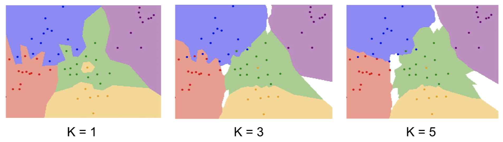
**K-Nearest Neighbors on images never used**
**Problems:**
- Very slow at test time and the Distance metrics on pixels are not infromative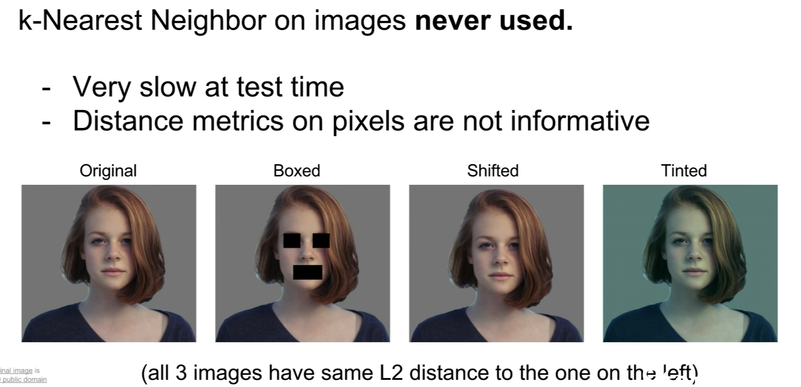
- Curse of dimensionality: if we expect the K-nearest neighbor to work well, we kind of need our training examples to cover the space quite densely. Otherwise our nearest neighbors could actually be quite far away and might not actually be very similar to our testing.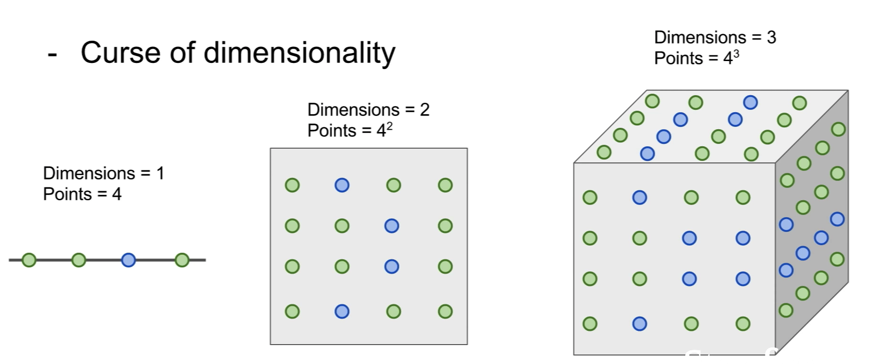

##### Hyperparameters
> - What is the best metrics 
> - What is the best K

- Idea #1: Choose hyperparametes that work best on the data <font color='red'>**Bad**: k=1 always works perfectly on  trainning data</font>
- Idea #2: Split data into train and test, choose hyperparameters htat work best on test data <font color='red'>**Bad**:  No idea how algorithm will perform on new data</font>
- Idea #3: Split data into train, val, and test; choose hyperparamters on val and eveluate on test <font color='green'>**Better** </font>
- Idea #4: Cross-Validation: Split data into folds, try each fold as validation and average the results. **Useful for small datasets, but not used too frequently on deep learning**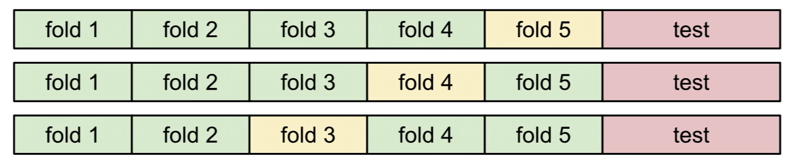

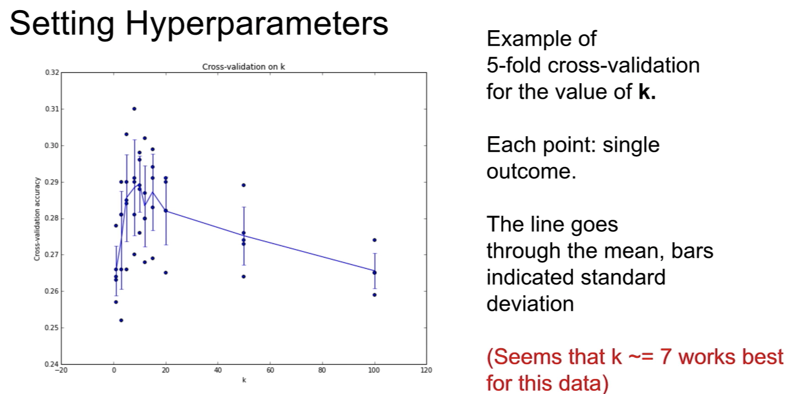

#### Linear classifiers
##### Parametric Approach
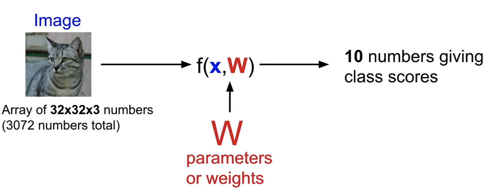
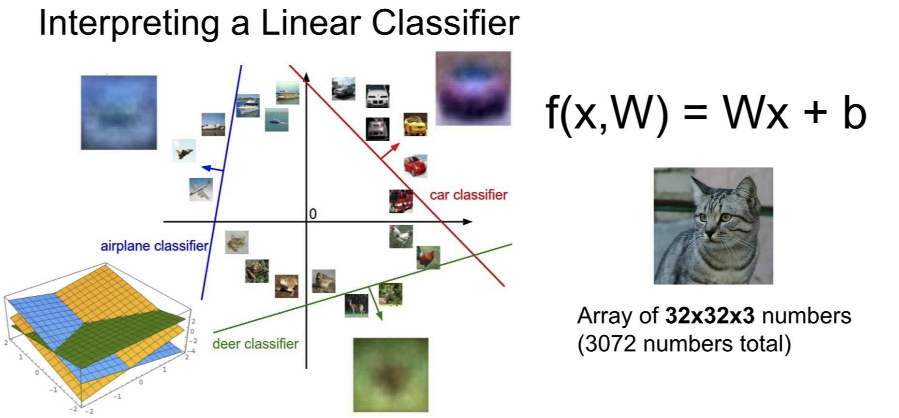

##### Hard cases for linear classifier
**We cannot draw a single line to separate two classes**
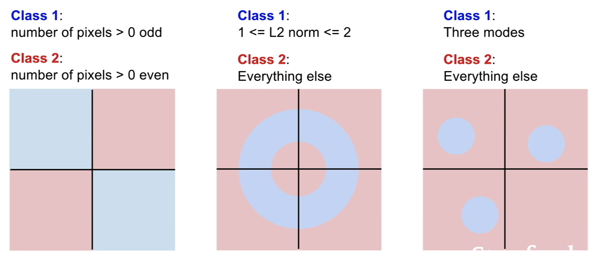


##### Loss function
> A loss function tells how good our current classifier is.
> Given a dataset of examples $\{(x_i,y_i)\}_{i=1}^N$, where $x_i$ i simage and $y_i$ is (integer) label. Loss over the dataset is a sum of loss over examples: $L = \frac{1}{N}\sum_i L_i(f(x_i,W),y_i)$
###### Muticlass SVM loss function
>  Given a dataset of examples $\{(x_i,y_i)\}_{i=1}^N$, where $x_i$ i simage and $y_i$ is (integer) label., and using the shorthand for the scores vector: $s = f(x_i, W)$, the SVM loss has the form $$L_i = \sum_{j\neq y_i} \begin{cases}
0& s_{y_i} \ge s_j +1\\
s_j - s_{y_i} + 1& Otherwise
\end{cases}  \\
= \sum_{j \neq y_i} max(0,s_j - s_{y_i} + 1)$$

```python
def L_i_vectorized(x,y,W)：
	scores = W.dot(x)
	margins = np.maximum(0, scores - scores[y] + 1)
	margins[y] = 0
	loss_i = np.sum(margins)
	return loss_i

```
**Q1: What is the min/max possible loss? **
- The minimal loss is zero
- The max is infinity

**Q2: At initialization W is small so all  $s \approx 0$ what is the loss?  **
- Number of classes minus one 

**Q3: What is the sum was over all classes(including $j = y_i$)**
- the loss increases by one

**Q4: What if we used mean instead of sum**
- Doesn't change

**Q5: What if we used $L_i = \sum_{y \neq y_i} max(0,s_j - s_{y_i} + 1)^2$**
- Different classification, because of change the trade-off between good and badness.

**Q5: Suppose that we found a W such that L=0, Is this W unique? **
- No, 2W is also has L = 0!

> $L(W) = \frac{1}{N}\sum_{i=1}^N L_i(f(x_i,W),y_i)$ will overfit the training data, so:
> 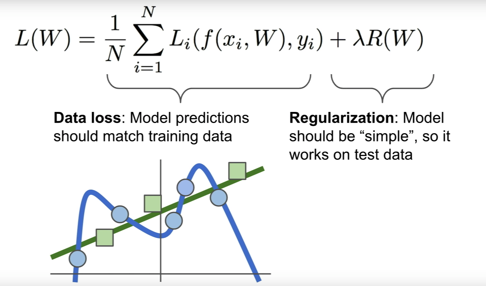
> 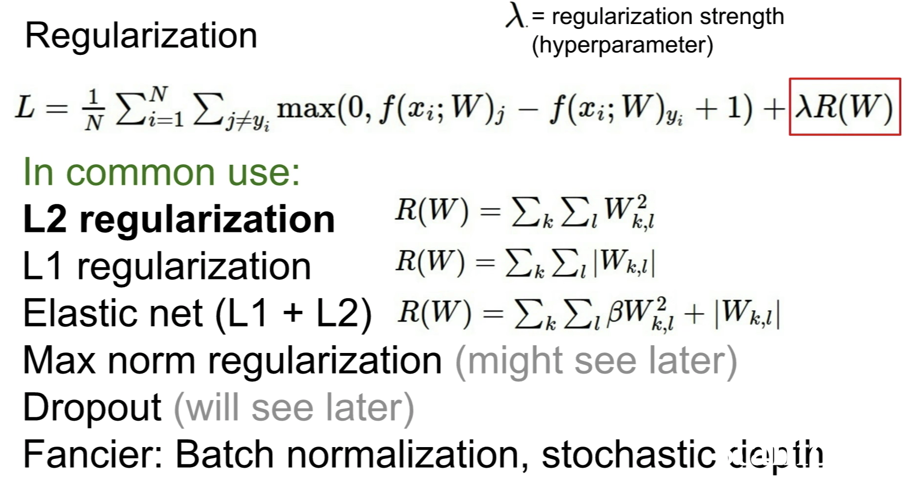


###### Softmax Classifier(Multinomial Logistic Regression)
> scores = unnormalized log probabilibies of the classes
>$P(Y = k|X=x_i) = \frac{e^{s_k}}{\sum_j e^{s_j}}, s = f(x_i; W)$
>Want to maximize the log likelihood, or( for a **loss function**) to minimize the negative log likelihood of the correct class: $L_i = -log P(Y = y_i | X = x_i)$
>In summary : $L_i = -log(\frac{e^{sy_i}}{\sum_j e^{sj}})$
>Eg:
>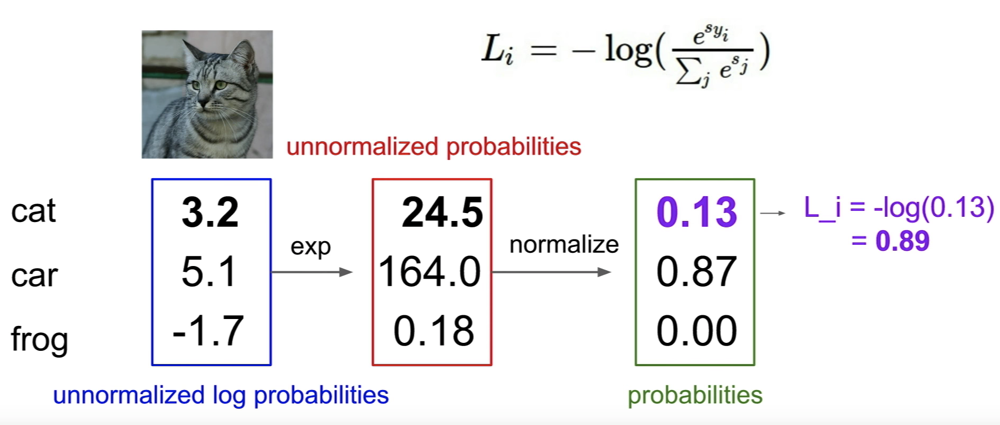

**Q1: Usually at initialization W is small, so all $s\approx 0$. What is the loss?**
- $L_i = logC$ 

###### Softmax vs. SVM
SVM get data point over the bar to be correctly classified and then just give up.
Softmax always try to continually improve the every single data point to get better and better.
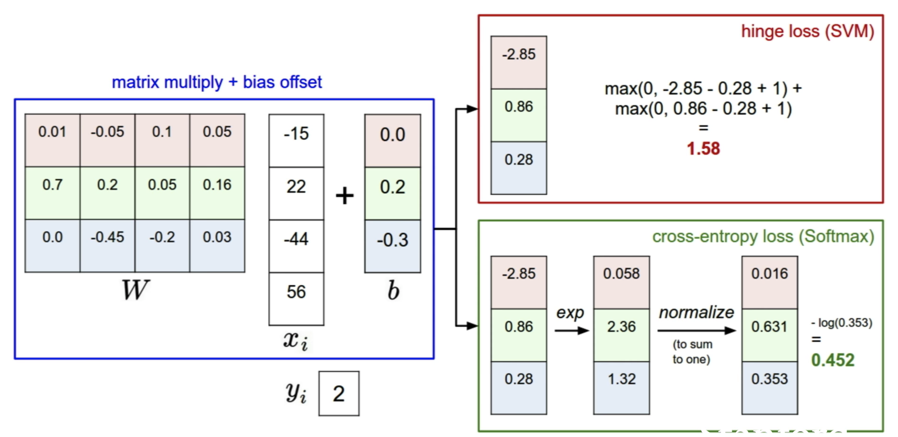

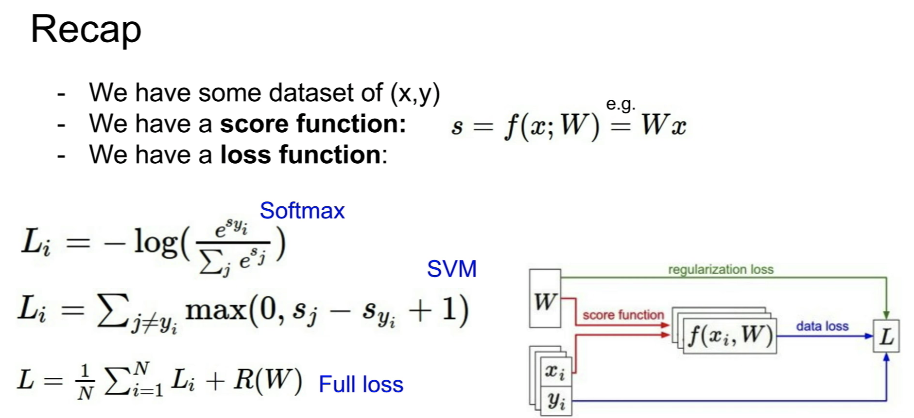

### Optimization
#### Follow the slop
The slop in any direction is the dot product of the direction with the gradient. The direction of steepest descent is the negative gradient.
- In 1-dimension, the derivative of a function: $\frac{df(x)}{dx}=\lim_{h \to 0} \frac{f(x+h) - f(x)}{h}$, 
- In multiple dimensions, the gradient is the vector of (partial derivatives) along each dimension
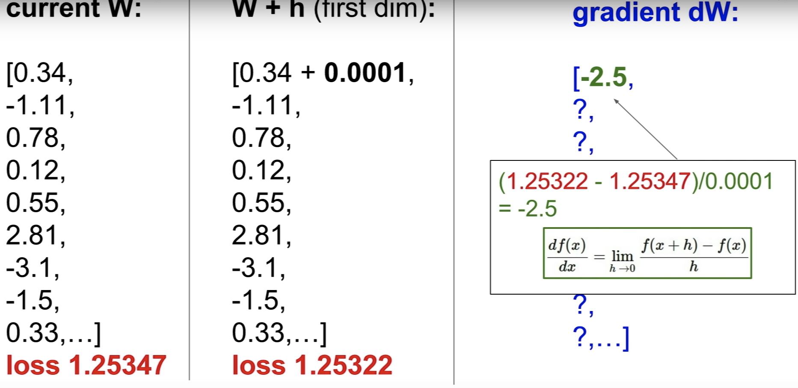
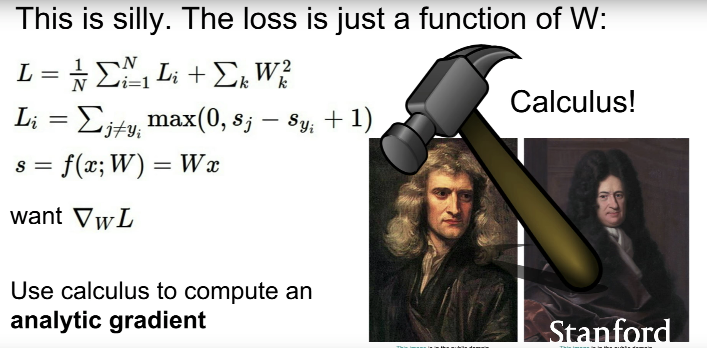
In practice: Always use analytic gradient, but check implementation with numerical gradient. This is called a **gradient check**

#### Gradient Descent

##### Vanilla gradient descent
```python
# vanilla gradient descent

while true:
	weights_grad = evaluate_gradient(loss_fun,data,weights)
	weights += - step_size * weights_grad # perform parameter update
```

##### Stochastic Gradient Descent (SGD)
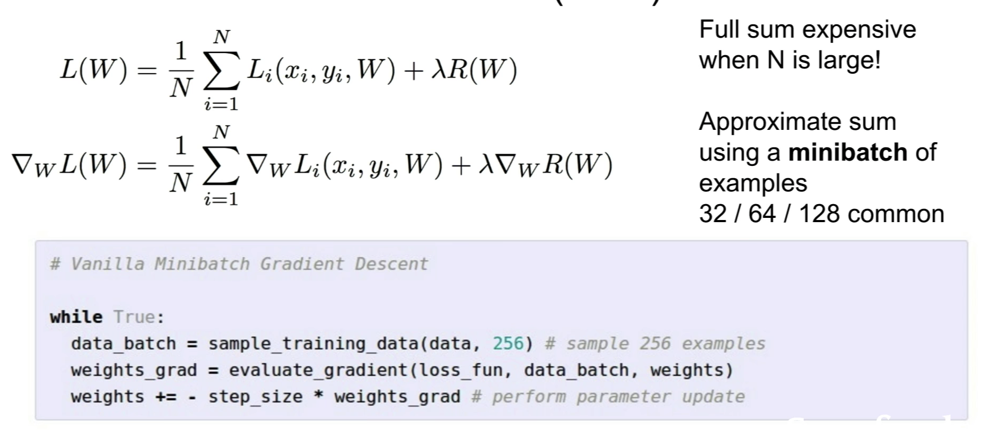

#### Feature representation 
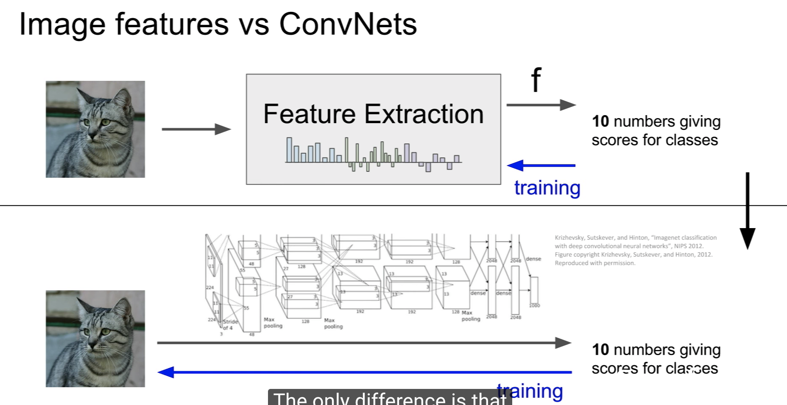


### Using computational graphs to compute gradient descent

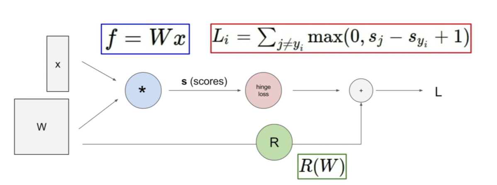
#### Backpropagation
- Set variables to each node
- Compute current gradient given the next variable. such as: the node $p = \frac{\partial f}{\partial{p}}$
- Multiply upstream gradient. According to the chain rule, $x = \frac{\partial f}{\partial x} =  \frac{\partial f}{\partial p} \times  \frac{\partial p}{\partial x} $
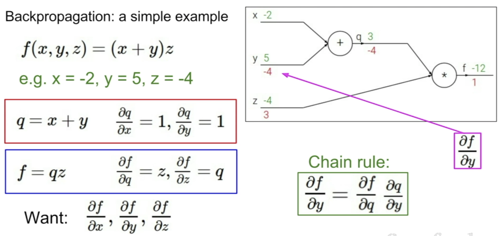
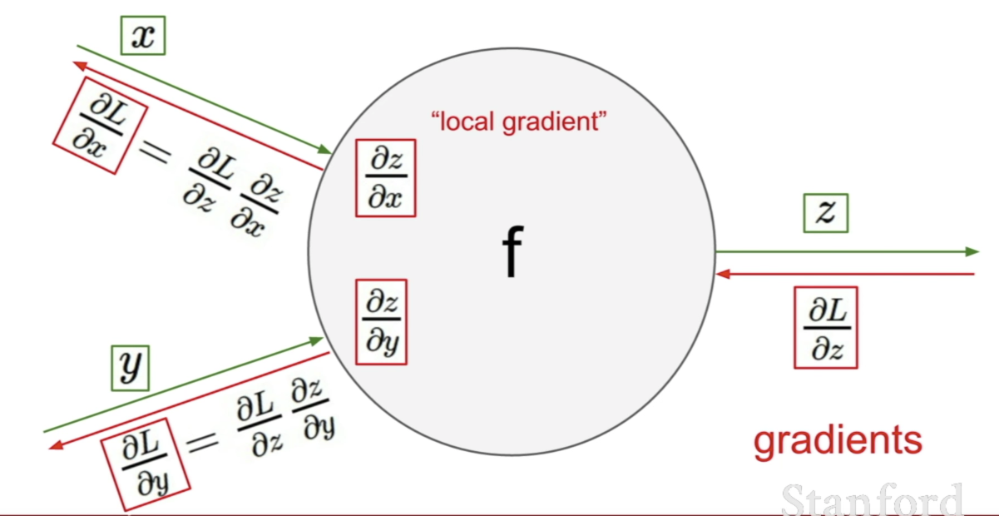
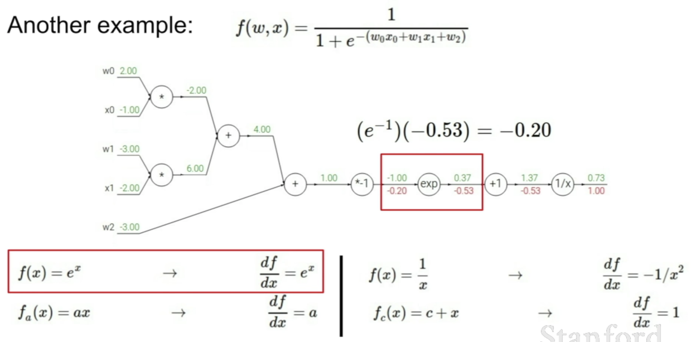
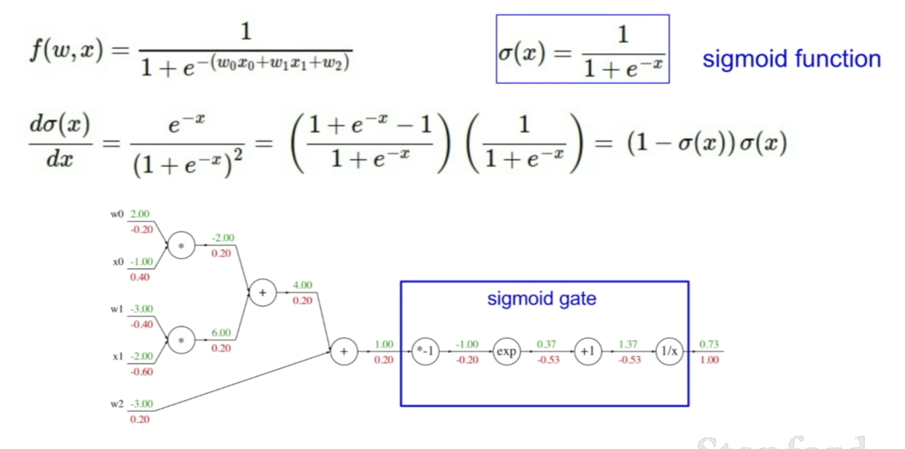

**Example:**
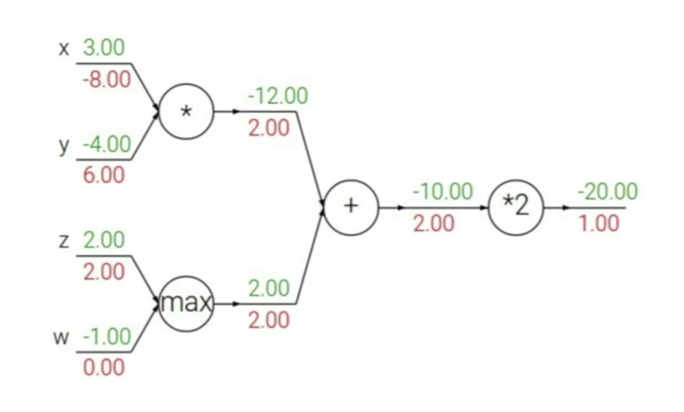
Q1: What is a max gate?
>The max gate assign the local gradient 1 to the maximum and 0 to the minimum.
So 
- The  z gradient is upstream 2 multiplying 1, equaling to 2
- The w gradient is upstream 2 multiplying 0, equaling to 0

Q2: What is a mul gate?
> The multiplication gate is the value of other variable.

Q3: What is Jacobian matrix?
> 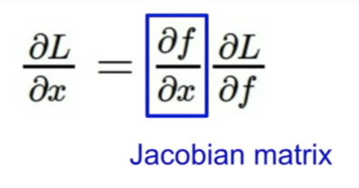

Q4: what is the size of the Jacobian matrix, if we have 4096-d input vector?
> [4096, 4096]

Example:
```python
def ComputationalGraph(object):
	#...
	def forward(inputs):
		# 1. [pass inputs to input gates...]
		# 2. forward the computational graph:
		for gate in self.graph.nodes_topologically_sorted():
			gate.forward()
		return loss # the final gate inthe graph outputs the loss
	
	def backward():
		for gate in reversed(self.graph.nodes_topoligically_sorted()):
			gate.backward() # little piece of backprop (chain rule applied)
		
		return inpyts_gradinets
			
```

### Summary
- Neural nets will be very large: impractical to write down gradient formula by hand for all parameters
- Backpropagation = recursive application of the chain rule along a computational graph to compute the gradients of all inputs/parameters/intermediates
- Implementations maintain a graph structure, where the nodes implement the forward()/backward API
- Forward: compute result of an operation and save any intermediates needed fro gradient computation in memory
- Backward: apply the chain rule to compute  the gradient of the loss function with respect to the inputs.


## Neural Networks
(Before) linear score function: $f = W\cdot x$
(Now)  :
- 2-layer Neural Network: $f =W_2\cdot max(0,W_1\cdot x)$, just a example, we can choose other non-linear function instead of `max`
- or 3-layer $f =W_3 \cdot max(0, W_2\cdot max(0,W_1\cdot x))$
- or ...N-layer
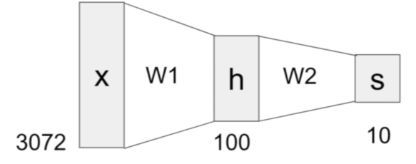
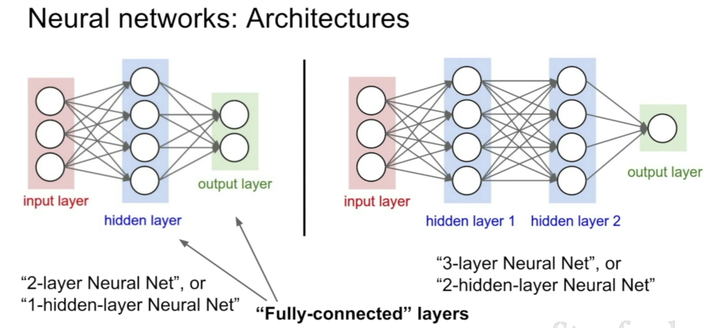

feed-forward computation of a neural network
```
class Neuron:
	# ...
	def neuron_tick(inputs):
		# assume inputs and weights are 1-D numpy arrays and bias is a number 
		cell_body_sum = np.sum(inputs * self.weights) + self.bias
		firing_rate = 1.0/(1.0 + math.exp(-cell_body_sum)) # sigmoid activation function
		return firing_rate
```

## Assignment 1
### How to get the gradient for 2-layer net with softmax loss function by computational graph
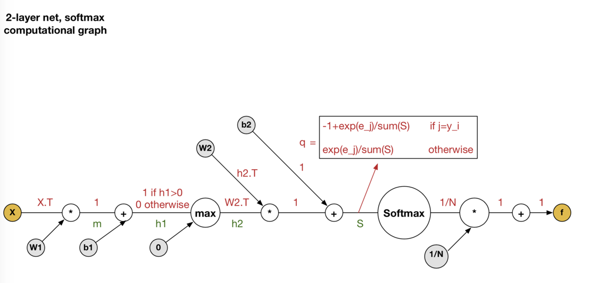


